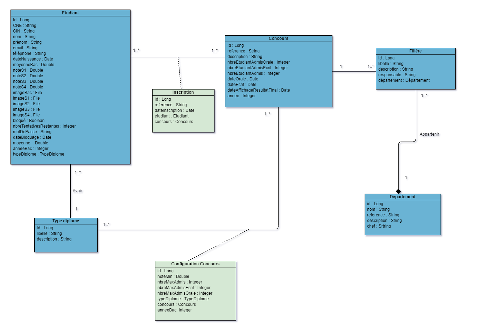
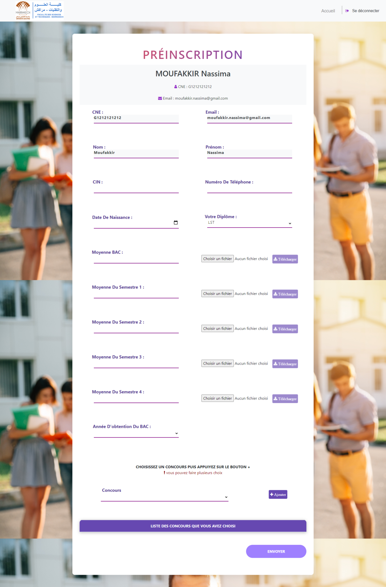

Table des matières
=================

<!--ts-->
   * [Description du projet](#Description-du-projet)
   * [Frameworks](#Frameworks)
   * [L'architecture MVC](#larchitecture-MVC)
      * [L’architecture Business](#Larchitecture-Business)
      * [L’architecture Web](#Larchitecture-Web)
   * [Conception](#Conception)
   * [Demo](#demo)
     * [Interface d'acceuil](#Interface-dacceuil)
     * [Formulaire de préinscription aux concours](#Formulaire-de-préinscription-aux-concours)
     * [Convocation générée](#Convocation-générée)
     * [Interface de la gestion des comptes des étudiants inscrits](#Interface-de-la-gestion-des-comptes-des-étudiants-inscrits)
     * [Interface de la gestion des concours](#Interface-de-la-gestion-des-concours)
<!--te-->

# Description du projet
L’objet de ce projet est de savoir et de trouver comment obtenir une gestion simplifiée et automatisée des préinscriptions, comment faire pour que ces préinscriptions aux concours soient accessibles et faciles pour les étudiants, mais aussi et surtout comment ramener la gestion des concours à l’ère moderne en proposant une gestion totalement informatisée, avec une constitution de dossier qui se gère sur l’application et qui évite aux étudiants de se déplacer. 
Cette application web permettra : 
- aux étudiants d’avoir une visibilité et une lisibilité fluide et concrète de l’ensemble des concours afin de se préinscrire en toute simplicité.
- à la commission d’avoir une liste des comptes des étudiants ainsi que des préinscriptions pour chaque filière de concours. De même, la commision aura la main sur les configurations des concours, des départements avec leurs filières, et sur celle des diplômes.

# Frameworks

	
	

Vous pouvez trouver la partie Frontend du projet ici : [FRONTEND](https://github.com/ImaneYASSIRI/Systeme_gestion_concours_FE)

# L'architecture MVC

L'architecture MVC est une façon d'organiser une interface graphique d'un programme. Elle consiste à distinguer trois entités que sont : le modèle, la vue et le contrôleur ayant chacun un rôle précis dans l'interface. Dans l'architecture MVC, les rôles des trois entités sont les suivants : 
1. **Modèle** : le modèle contient les données manipulées par le programme. Il assure la gestion de ces données et garantit leur intégrité. Dans le cas typique d'une base de données, c'est le modèle qui la contient. Le modèle offre des méthodes pour mettre à jour ces données (CRUD). Il offre aussi des méthodes pour récupérer ces données. 
2. **Vue** : la vue fait l'interface avec l'utilisateur. Sa première tâche est d'afficher les données qu'elle a récupérées auprès du modèle. Sa seconde tâche est de recevoir toutes les actions de l'utilisateur. Ces différents événements sont envoyés au contrôleur. 
3. **Contrôleur** : le contrôleur est chargé de la synchronisation du modèle et de la vue. Il reçoit tous les événements de l'utilisateur et enclenche les actions à effectuer. Si une action nécessite un changement des données, le contrôleur demande la modification des données au modèle et ensuite avertit la vue que les données ont changé pour que celle-ci se mette à jour.

#### L’architecture Business

Le M de l'architecture MVC représente la partie back-end (la partie business), celle-ci est chargée du métier et de l'intelligence de l'application.

1. **Bean** : représente les entités de l’application. 
2. **Dao** : permet d’accéder à la BD d’une façon orientée objet. La communication avec la BD se fait en 2 parties : CRUD Operations et ORM (la transformation des tables en objets et vice-versa). 
3. **Service** : c’est l’intelligence et le métier de l’application. 
4. **WS** : permet de gérer la communication avec des systèmes hétérogènes, et d’exposer les services ou de les consommer. On y trouve 2 protocoles : SOAP et REST.

#### L’architecture Web

Le V et le C représentent la partie front-end (web) de l'application, c'est à dire l'ensemble des interfaces graphiques qui rendent l'expérience conviviale à l'utilisateur.

1. **Modèle** : c’est l’équivalent des bean de la partie business. Cette couche est comme un format d’échange entre la partie front-end et back-end à travers la couche WS. 
2. **Service** : c'est le moyen qui permet de centraliser les données et les traitements entre les composants du même module. Il permet aussi la communication avec le REST via HTTP Client qu'on injecte. Celui-ci va envoyer une requête au REST, et récupérer par la suite le résultat. 
3. **Vue** : elle contient la partie HTML et CSS de notre application. 
4. **Contrôleur** : le contrôleur s’intéresse à des petits traitements côté client ainsi que des validations syntaxiques.

# Conception

> ### Diagramme de cas d'utilisation préliminaire

> ### Diagramme des classes

# Demo

Voici des captures des principale interfaces de l'application.

> ## Interface d'acceuil

> ## Formulaire de préinscription aux concours

> ## Convocation générée

> ## Interface de la gestion des comptes des étudiants inscrits

> ## Interface de la gestion des concours

